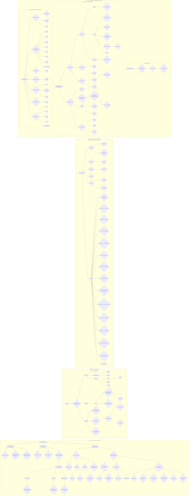

```mermaid
graph LR
    subgraph "Part 1: Core Concept, Structure, and AI Specifications"
        A[EliteViralAI Documentation] --> B(Main Description & Core Philosophy)
        B --> C{Project Name: EliteViralAI}
        B --> D{Core Goal: Guide users in creating potentially viral content}
        B --> E{"Key Constraint: AI's role is advisory (does not create or edit content)"}

        A --> F("Basic Structure (System Foundation)")
        F --> G{Target Platform: Windows 11}
        F --> H{Tooling Philosophy: FOSS only}
        F --> I{Primary Focus: Personal Use, Scalability, Modularity}
        I --> J(Detailed Structure Components)
        J --> K("User Interface (UI)")
        K --> L{"User-Friendly GUI, Modern look, Light/Dark modes"}
        J --> M(AI Integration)
        M --> N{"Open-source/free AI models/tools/services only"}
        J --> O(Scalability & Architecture)
        O --> P{Modular design, prevents code overhauls}

        A --> Q("A.I. Specifications (AI Capabilities & Role)")
        Q --> R{Primary Function: Analysis}
        R --> S{Data Scraping & Parsing}
        R --> T{Success Analysis}
        R --> U{Trend Identification}
        U --> V{Detect pre-trends}
        U --> W{Identify current events}
        U --> X{Recognize broader cultural trends}
        R --> Y{"Opportunity Finding (high interest, low content)"}

        Q --> Z{Primary Function: User Interaction & Guidance}
        Z --> AA{Provide suggestions based on analysis}
        Z --> AB{Video Content Guidance}
        AB --> AC{Suggest video ideas}
        AB --> AD{Easy images & music montage ideas}
        AB --> AE{Video with viral chance}
        AB --> AF(Subtopic Placeholder)
        Z --> AG{S.E.O. & Content Strategy Guidance}
        AG --> AH{Suggest keywords}
        AG --> AI{Identify backlink opportunities}
        AG --> AJ{Ideas for mass mailing campaigns}
        AG --> AK{"Suggest social media post topics/formats"}
        AG --> AL{Generate blog content}
        AG --> AM{Propose ethical clickbait strategies}
    end

    subgraph "Part 2: Development, Tools & Services"
        subgraph "Development (Technical Implementation)"
            AN[EliteViralAI] --> AO{"Core System: EliteViralAI (Application Logic)"}
            AO --> AP(Frontend)
            AP --> AQ(U.I.)
            AP --> AR(A.I. Chat Box Interface)
            AP --> AS(Sidebar)
            AS --> AT(Chat Box)
            AS --> AU(Analyzer)
            AS --> AV(Stats)
            AS --> AW(Settings)
            AW --> AX{A.P.I. Key}
            AW --> AY{"Dark/Light Mode"}
            AS --> AZ(Others)

            AO --> BA(Backend)
            BA --> BB(A.P.I.)
            BB --> BC{"Handles Frontend/Core Logic/External Services communication"}
            BB --> BD{Manages data processing and AI interactions}
            BB --> BE{Integrates external APIs}
            BE --> BF{"https://aistudio.google.com"}
            BE --> BG{"https://huggingface.co"}

            AO --> BH(Interactions)
            BH --> BI{Backend interacts with websites & GitHub repos}
            BH --> BJ{User interacts with Frontend}
            BH --> BK{Frontend communicates with Backend via API}
        end
    end

    subgraph "Tools & Services (External Dependencies & Resources)"
        subgraph "Media Creation Tools (User Focused - Guided by AI)"
            BL[Media Creation Tools] --> BM{Image Generation}
            BM --> BN{"https://yodayo.com"}
            BM --> BO{"https://dream-machine.lumalabs.ai"}
            BL --> BP{Music Generation}
            BP --> BQ{"https://suno.com"}
            BL --> BR{Short Video Tools}
            BR --> BS{"https://clip.opus.pro"}
            BL --> BT{Blog Creation}
            BL --> BU{Overall Useful}
            BU --> BV{"https://github.com"}
            BU --> BW{"https://huggingface.co"}

            BL --> BX{GitHub repo}
            BX --> BY{"https://github.com/yt-dlp/youtube-dl"}
            BX --> BZ{"https://github.com/DIYgod/RSSHub"}
            BX --> CA{"https://github.com/imputnet/cobalt"}
            BX --> CB{"https://github.com/glanceapp/glance"}
            BX --> CC{"https://github.com/FreeTubeApp/FreeTube"}
            BX --> CD{"https://github.com/pytube/pytube"}
            BX --> CE{"https://github.com/jimmylvi/BiblGPT-v1"}
            BX --> CF{"https://github.com/finaldie/auto-news"}
            BX --> CG{"https://github.com/mitchelly/Trending-youtube-Scraper"}
            BX --> CH{"https://github.com/ourourownstory/neural_prophet"}
            BX --> CI{"https://github.com/GeneralMills/pytrends"}
            BX --> CJ{"https://github.com/ericciarla/TrendFinder"}
            BX --> CK{"https://github.com/davidteather/TikTok-Api"}
            BX --> CL{"https://github.com/drawrowfly/tiktok-scraper"}
            BX --> CM(Subtopic Placeholder)

        end
    end

    subgraph "Part 3: User Workflow, Data, Content Lifecycle & AI Infrastructure"
        subgraph "User Workflow & Interaction"
            CN[User Workflow & Interaction] --> CO{User interacts with Frontend}
            CO --> CP{Receive A.I. insights}
            CP --> CQ{User actions based on insights}
        end

        subgraph "Data Handling & Content Generation Pathway"
            CR[Data Handling & Content Generation Pathway] --> CS{A.I. Insights Feed Into}
            CS --> CT{Media Data Analysis}
            CT --> CU(Image)
            CU --> CV{subject, style, number, other}
            CT --> CW(Video)
            CW --> CX{subject, style, number, other}
            CW --> CY{Suggest top X listicles}
            CW --> CZ{"music X with images X (montage style)"}
            CW --> DA{automated video creation}
            DA --> DB{"trial sites / free sites"}
            CW --> DC(others)
            CT --> DD{Music & Sound}
            DD --> DE{subject, style, number, other}
            CS --> DF{Viral Ideas Generation}
            DF --> DG{Current trends}
            DF --> DH{Relevant news}
            CS --> DI{Resource Identification}
            DI --> DJ{Artificial Media}
            DJ --> DK{image generation websites}
            DJ --> DL{music generation websites}
            DI --> DM{Free Resources}
            CR --> DN{"User Actions (Post-Insight)"}
            DN --> DO{Data Acquisition}
            DN --> DP{"Video Creation (Video Editing Software)"}
            DN --> DQ{Publishing}
            DQ --> DR{"YouTube, TikTok, Instagram, X/&quot;Twitter&quot;, Twitch, Facebook, Reddit"}
            DQ --> DS{Publishing schedule}
            DQ --> DT{Multi-Accounts}
            DN --> DU{S.E.O. & Virality Refining}
            DU --> DV{Advertising}
            DU --> DW{Backlinks}
            DU --> DX{Free Resources}
        end

        subgraph "AI Infrastructure & Data (Potential Backend Resources)"
            DY[AI Infrastructure & Data] --> DZ{"Data Storage/Vector DBs"}
            DZ --> EA{"AstraDB (DataStax)"}
            DZ --> EB{Hugging Face}
            DZ --> EC{Qdrant}
            DY --> ED{AI Model Hosting & Inference Platforms}
            ED --> EE{Baseten}
            ED --> EF{Chutes}
            ED --> EG{Fireworks}
            ED --> EH{Grog}
            ED --> EI{Modal}
            ED --> EJ{Nebius}
            ED --> EK{Together AI}
            ED --> EL(Subtopic Placeholder)
            DY --> EM{Development Tools}
            EM --> EN{GitHub}
            DY --> EO{"LLM Aggregators/Routers"}
            EO --> EP{OpenRouter}
            DY --> EQ{LLM Providers & Platforms}
            EQ --> ER{AI21}
            EQ --> ES{Google AI Studio}
            EQ --> ET{Upstage}
            DY --> EU{MLOps & Experiment Tracking}
            EU --> EV{ClearML}
            DY --> EW{"Specialized AI APIs/Tools"}
            EW --> EX{E2B}
            EW --> EY{Novita}
            EW --> EZ{OpenPipe}
            EW --> FA{Tavily}
            EW --> FB(Subtopic Placeholder)
        end
    end

```